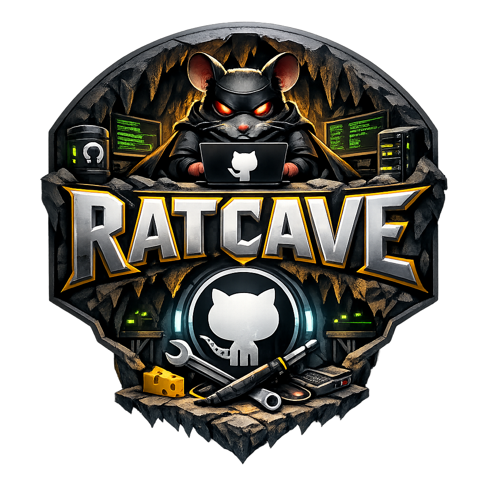

<h3 align="center">
	<br/>
	Ratcave - Protfolio
</h3>

<p align="center">
	<a href="https://github.com/FIlip-Work-Hulten/Rice/stargazers">
		
	</a>
	<a href="https://github.com/FIlip-Work-Hulten/Rice/issues">
		
	</a>
	<a href="https://github.com/FIlip-Work-Hulten/Rice/graphs/contributors">
		
	</a>
</p>


## Table of Contents

- [About](#about)
- [Demo](#demo)
- [Features](#features)
- [Quick Start](#quick-start)
- [Contributing](#contributing)
- [License](#license)

## About

Rice is a small personal site and project collection. This README is crafted to be interactive: badges, collapsible sections, and quick links to explore the project.

<details>
<summary><strong>Demo</strong> — click to expand</summary>

You can open the site locally from `src/frontend/html/index.html` or run the backend in `src/backend/app.py`.

</details>

## Features

- Interactive header with `assets/ratcave.png` as the logo.
- Badges for stars, issues and contributors (replace `your-username/your-repo` with your repo).
- Preview image and collapsible demo/usage sections.

## Quick Start

1. Install Python dependencies (backend):

```bash
python3 -m pip install -r src/backend/requirements.txt
```

2. Run the backend (development):

```bash
python3 -m flask run --app src/backend/app.py --port 5001
```

If you prefer to run the script directly:

```bash
python3 src/backend/app.py
```

3. Open the frontend: `src/frontend/html/index.html` in your browser or visit `http://127.0.0.1:5001` when the backend is running.

## Contributing


If you enjoy this project, please consider contributing and starring the repo — it helps a lot!

<p align="center">
	<a href="https://github.com/FIlip-Work-Hulten/Rice/stargazers">
		
	</a>
</p>

---

### Underline for Contribute / Stars

To visually emphasise contributions and stars, there's a short underbar below the button:

<p align="center">
	<span style="display:inline-block;width:220px;border-bottom:3px solid #b7bdf8;margin-top:8px"></span>
</p>

If you want a different color or width, edit the inline style above.

## License

This project is provided as-is. Replace this section with your chosen license.

